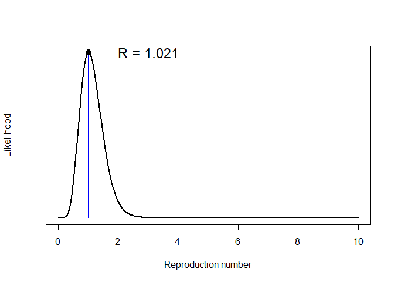
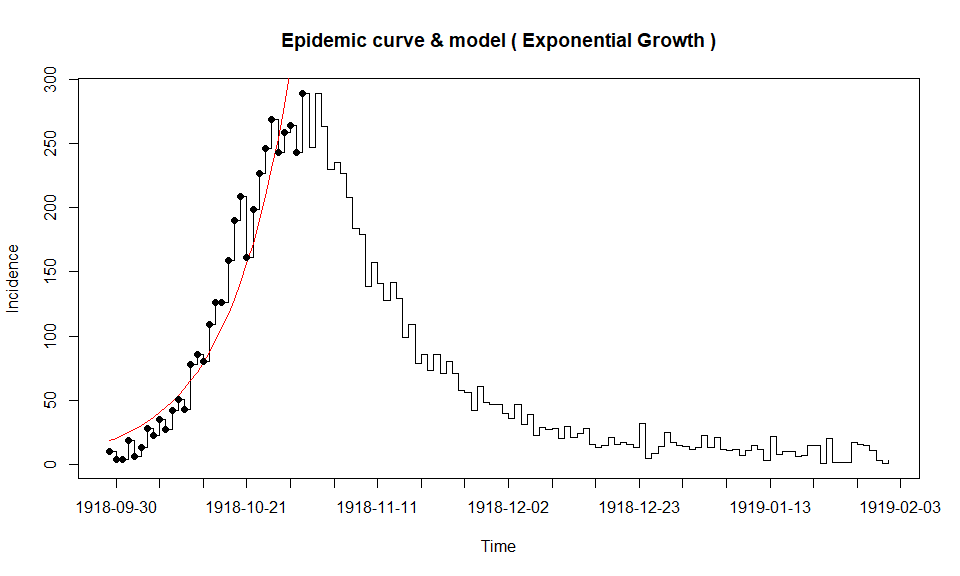
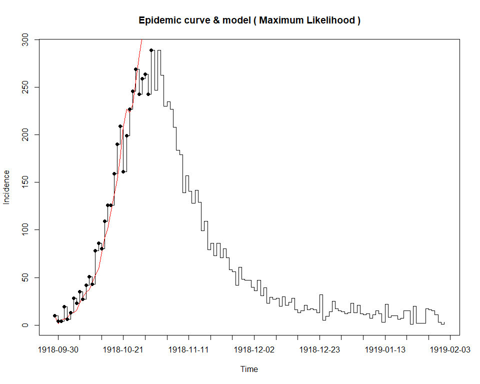
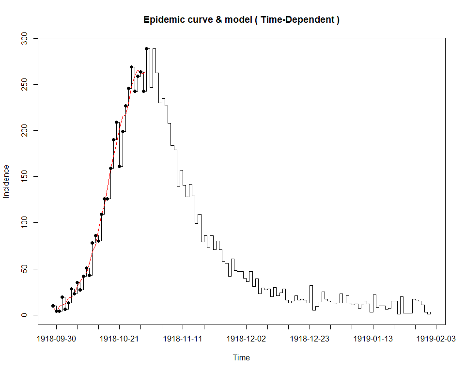

\newpage

# Introduction

All contents come from

- R0 packages - cRAN and github
- earlyR - CRAN and vignettes

Two excellent packages on reproduction numbers and etc 

# Getting ready


```r
library(tidyverse)
```

```
## -- Attaching packages --------------------------------------- tidyverse 1.3.0 --
```

```
## v ggplot2 3.3.2     v purrr   0.3.4
## v tibble  3.0.4     v dplyr   1.0.2
## v tidyr   1.1.2     v stringr 1.4.0
## v readr   1.4.0     v forcats 0.5.0
```

```
## -- Conflicts ------------------------------------------ tidyverse_conflicts() --
## x dplyr::filter() masks stats::filter()
## x dplyr::lag()    masks stats::lag()
```

# References

http://www.repidemicsconsortium.org/earlyR/


# Early R Package


```r
library(earlyR)
library(incidence)
```

## 1. make a fake dataset

Confirmed cases with the following symptom onset dates


```r
onset <- as.Date(c("2017-02-04", "2017-02-12", "2017-02-15",
                   "2017-02-23", "2017-03-01", "2017-03-01",
                   "2017-03-02", "2017-03-03", "2017-03-03"))    
```

## 2. set the date with NO cases

Generate incidence


```r
today <- as.Date("2017-03-21")
i <- incidence(onset, last_date = today)
```

## 3. To estimate R

Need estimates of the mean and standard deviation of the serial interval,


```r
mu <- 15.3 # mean in days days
sigma <- 9.3 # standard deviation in days
```

## 4. Estimate R


```r
res <- get_R(i, si_mean = mu, si_sd = sigma)
res
```

```
## 
## /// Early estimate of reproduction number (R) //
##  // class: earlyR, list
## 
##  // Maximum-Likelihood estimate of R ($R_ml):
## [1] 1.021021
## 
## 
##  // $lambda:
##   0.01838179 0.0273192 0.03514719 0.0414835 0.04623398 0.04946402...
## 
##  // $dates:
## [1] "2017-02-05" "2017-02-06" "2017-02-07" "2017-02-08" "2017-02-09"
## [6] "2017-02-10"
## ...
## 
##  // $si (serial interval):
## A discrete distribution
##   name: gamma
##   parameters:
##     shape: 2.70655567117586
##     scale: 5.65294117647059
```

## 5. distribution of likely values of R, and the Maximum-Likelihood (ML) estimation


```r
plot(res)
```

<!-- -->

# R0 package

A total  of 5 methods to estimate epid parameters

- the incubation period, i.e. time between infection and symptoms;
- the serial interval, i.e. time between symptoms onset in primary and secondary cases; 
- and the initial reproduction ratio, i.e. the average number of secondary cases per primary case.

## loads library


```r
library(R0) 
```

```
## Loading required package: MASS
```

```
## 
## Attaching package: 'MASS'
```

```
## The following object is masked from 'package:dplyr':
## 
##     select
```

## Create a fake epidemic curve can be input as a list of dates


```r
epid <- c("2012-01-01", "2012-01-02", "2012-01-02", "2012-01-03")
# or as incidence counts
epid.count <- c(1,2,4,8)
```


## create generation time : gamma distribution, 

Parameters:

- with mean 2.6 time units and 
- standard deviation 1 time unit


```r
GT.flu <- generation.time("gamma", c(2.6, 1))
GT.flu
```

```
## Discretized Generation Time distribution
## mean: 2.600862 , sd: 1.039405 
## [1] 0.0000000000 0.1191748162 0.3916040666 0.3151389202 0.1287482123
## [6] 0.0358432237 0.0078162034 0.0014400089 0.0002345487
```

## Load example dataset 

Applies methods:

- Exponential Growth, 
- Max Likelihood, 
- SB (Sequantial Bayesian), 
- TD (Time-dependent)


```r
data(Germany.1918)
res.R <- estimate.R(Germany.1918, GT = GT.flu, 
                    methods = c("EG","ML","SB","TD"))
```

```
## Waiting for profiling to be done...
```

```
## Warning in est.R0.TD(epid = c(`1918-09-29` = 10, `1918-09-30` = 4, `1918-10-01`
## = 4, : Simulations may take several minutes.
```

```
## Warning in est.R0.TD(epid = c(`1918-09-29` = 10, `1918-09-30` = 4, `1918-10-01`
## = 4, : Using initial incidence as initial number of cases.
```

```r
res.R$estimates
```

```
## $EG
## Reproduction number estimate using  Exponential Growth  method.
## R :  1.343115[ 1.32636 , 1.360239 ]
## 
## 
## $ML
## Reproduction number estimate using  Maximum Likelihood  method.
## R :  1.214487[ 1.161099 , 1.269497 ]
## 
## 
## $SB
## Reproduction number estimate using  Sequential Bayesian  method.
## 0 0 2.05 0.7 1.18 1.72 1.37 1.55 1.29 1.45 ...
## 
## 
## $TD
## Reproduction number estimate using  Time-Dependent  method.
## 2.099252 2.111212 1.621546 1.742409 2.030331 1.79388 1.538487 1.396268 1.470106 1.505215 ...
```

## Plot 


```r
plot(res.R) 
```

## The fit

- Displays fit to the epidemic curve
- sensitivity analysis according to choice of time window for exponential growth


```r
plotfit(res.R$estimates$EG)
```

<!-- -->


```r
plotfit(res.R$estimates$ML)
```

<!-- -->


```r
plotfit(res.R$estimates$SB)
```


```r
plotfit(res.R$estimates$TD)
```

<!-- -->

# EpiEstim package

No time 


