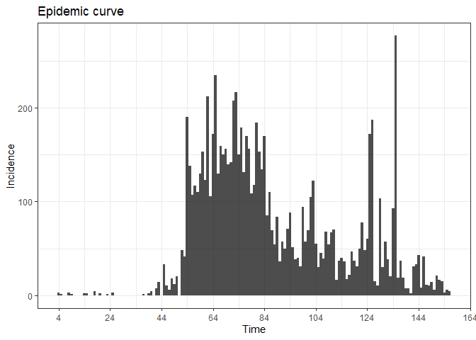
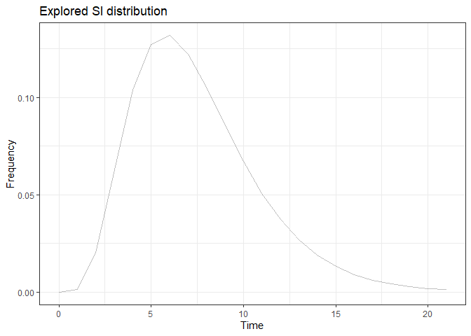
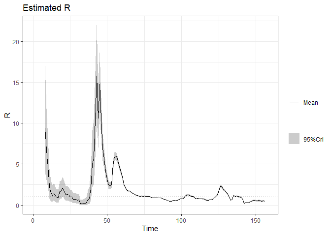

# Motivation

To model the time-dependent reproduction number of COVID-19 for Malaysia

# Methods

- Reproduce methods proposed in EpiEstim package
- Reference  https://cran.r-project.org/web/packages/EpiEstim/vignettes/demo.html

# Prepare environment


```r
library(tidyverse)
```

```
## -- Attaching packages -------------------------------------------------------------------------------------------- tidyverse 1.3.0 --
```

```
## v ggplot2 3.3.2     v purrr   0.3.4
## v tibble  3.0.1     v dplyr   1.0.0
## v tidyr   1.1.0     v stringr 1.4.0
## v readr   1.3.1     v forcats 0.5.0
```

```
## -- Conflicts ----------------------------------------------------------------------------------------------- tidyverse_conflicts() --
## x dplyr::filter() masks stats::filter()
## x dplyr::lag()    masks stats::lag()
```

```r
library(EpiEstim)
```


# Get data

## From github


```r
covid <- read_csv('https://raw.githubusercontent.com/RamiKrispin/coronavirus/master/csv/coronavirus.csv')
```

```
## Parsed with column specification:
## cols(
##   date = col_date(format = ""),
##   province = col_logical(),
##   country = col_character(),
##   lat = col_double(),
##   long = col_double(),
##   type = col_character(),
##   cases = col_double()
## )
```

```
## Warning: 35724 parsing failures.
##   row      col           expected  actual                                                                                   file
## 28861 province 1/0/T/F/TRUE/FALSE Alberta 'https://raw.githubusercontent.com/RamiKrispin/coronavirus/master/csv/coronavirus.csv'
## 28862 province 1/0/T/F/TRUE/FALSE Alberta 'https://raw.githubusercontent.com/RamiKrispin/coronavirus/master/csv/coronavirus.csv'
## 28863 province 1/0/T/F/TRUE/FALSE Alberta 'https://raw.githubusercontent.com/RamiKrispin/coronavirus/master/csv/coronavirus.csv'
## 28864 province 1/0/T/F/TRUE/FALSE Alberta 'https://raw.githubusercontent.com/RamiKrispin/coronavirus/master/csv/coronavirus.csv'
## 28865 province 1/0/T/F/TRUE/FALSE Alberta 'https://raw.githubusercontent.com/RamiKrispin/coronavirus/master/csv/coronavirus.csv'
## ..... ........ .................. ....... ......................................................................................
## See problems(...) for more details.
```

## Malaysia data


```r
mys <- covid %>% 
  select(date, country, type , cases) %>% 
  filter(country == 'Malaysia', type == 'confirmed') %>%
  rename(Time = date, I = cases) %>% data.frame()
```


# Calculate R

Setting the mean_si = 7.5 and std_si = 3.4. What would be the mean_si and std_si?

The problem is R is estimated too early.

What would be the earliest time to start and time to end?

t_start = need to adjust
t_end = need to adjust


```r
mys_parametric_si <- estimate_R(mys, 
                                method = "parametric_si",
                                config = make_config(list(mean_si = 7.5, 
                                                          std_si = 3.4)))
```

```
## Default config will estimate R on weekly sliding windows.
##     To change this change the t_start and t_end arguments.
```

```
## Warning in estimate_R_func(incid = incid, method = method, si_sample = si_sample, : You're estimating R too early in the epidemic to get the desired
##             posterior CV.
```

```r
glimpse(mys_parametric_si)
```

```
## List of 8
##  $ R         :'data.frame':	149 obs. of  11 variables:
##   ..$ t_start          : num [1:149] 2 3 4 5 6 7 8 9 10 11 ...
##   ..$ t_end            : num [1:149] 8 9 10 11 12 13 14 15 16 17 ...
##   ..$ Mean(R)          : num [1:149] 9.44 6.73 4.69 2.28 1.46 ...
##   ..$ Std(R)           : num [1:149] 3.339 2.245 1.563 0.933 0.651 ...
##   ..$ Quantile.0.025(R): num [1:149] 4.077 3.08 2.143 0.838 0.473 ...
##   ..$ Quantile.0.05(R) : num [1:149] 4.7 3.513 2.445 0.995 0.574 ...
##   ..$ Quantile.0.25(R) : num [1:149] 7.031 5.117 3.561 1.606 0.981 ...
##   ..$ Median(R)        : num [1:149] 9.05 6.49 4.52 2.16 1.36 ...
##   ..$ Quantile.0.75(R) : num [1:149] 11.43 8.08 5.63 2.83 1.83 ...
##   ..$ Quantile.0.95(R) : num [1:149] 15.52 10.8 7.52 4 2.67 ...
##   ..$ Quantile.0.975(R): num [1:149] 17.03 11.8 8.21 4.44 2.98 ...
##  $ method    : chr "parametric_si"
##  $ si_distr  : Named num [1:157] 0 0.00127 0.02002 0.06267 0.10375 ...
##   ..- attr(*, "names")= chr [1:157] "t0" "t1" "t2" "t3" ...
##  $ SI.Moments:'data.frame':	1 obs. of  2 variables:
##   ..$ Mean: num 7.5
##   ..$ Std : num 3.42
##  $ dates     : int [1:156] 1 2 3 4 5 6 7 8 9 10 ...
##  $ I         : num [1:156] 0 0 0 3 1 0 0 3 1 0 ...
##  $ I_local   : num [1:156] 0 0 0 3 1 0 0 3 1 0 ...
##  $ I_imported: num [1:156] 0 0 0 0 0 0 0 0 0 0 ...
##  - attr(*, "class")= chr "estimate_R"
```
# Plot

- plots the incidence
- plots the serial interval distribution


```r
p_I <- plot(mys_parametric_si, "incid") 
p_I + theme_bw()
```

<!-- -->

```r
p_SI <- plot(mys_parametric_si, "SI")  
p_SI + theme_bw()
```

<!-- -->

```r
p_Ri <- plot(mys_parametric_si, "R")
p_Ri + theme_bw()
```

<!-- -->

The $R_t$ is very high nearly day 50. Reasons:

- One possible explanation is that COVID-19 is transmissible before the onset of symptoms, resulting in much shorter serial intervals than expected, possibly shorter than the incubation period
- Alternatively, and very likely, there may be non-symptomatic, sub-clinical spreaders of the disease, who are undetected.
- some cases transmitting the disease very soon after infection, possibly before the onset of symptoms (so-called super-spreaders), and some cases being sub-clinical, and thus undetected, spreading the disease as well, while other cases have a serial interval more consistent with that of MERS or SARS, with a mean around 8 days.

# Calculate R with uncertainty

incorporate this uncertainty around the serial interval distribution by allowing specification of a distribution of distributions of serial intervals. So let’s 

- retain the mean SI estimated by Li et al of 7.5 days, with an SD of 3.4
- but let’s also allow that mean SI to vary between 2.3 and 8.4 
- Use a truncated normal distribution with an SD of 2.0.
- We’ll also allow the SD or the SD to vary between 0.5 and 4.0.


```r
# mys_res_uncertain_si <- estimate_R(mys, method = "uncertain_si", 
#                                   config = make_config(list(mean_si = 7.5, std_si = 3.4, 
#                                                             std_mean_si = 2, 
#                                                             min_mean_si = 2.3, max_mean_si = 8.4, 
#                                                             std_std_si = 2, 
#                                                             min_std_si = 0.5, max_std_si = 4, 
#                                                             n1 = 1000, n2 = 1000)))

# plot_Ri(mys_res_uncertain_si)
```

