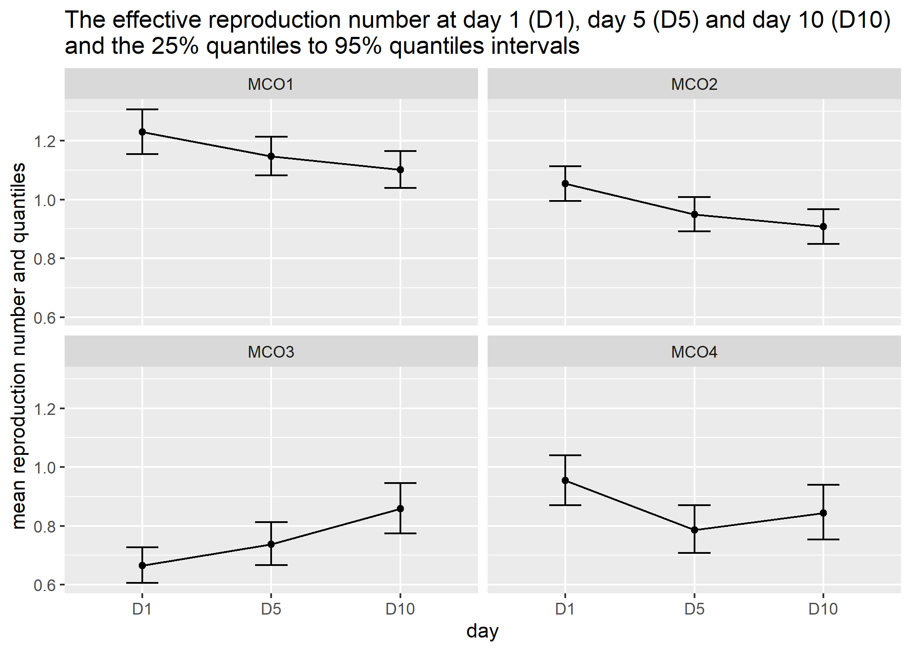

# Motivation

To model the time-dependent reproduction number of COVID-19 for Malaysia

# Methods

-   Reproduce methods proposed in EpiEstim package
-   Reference <https://cran.r-project.org/web/packages/EpiEstim/vignettes/demo.html>

Data from

-   WHO from github
-   Crowd-sourcing data from data world

# Prepare environment


```r
library(tidyverse)
```

```
## -- Attaching packages --------------------------------------- tidyverse 1.3.0 --
```

```
## v ggplot2 3.3.2     v purrr   0.3.4
## v tibble  3.0.4     v dplyr   1.0.2
## v tidyr   1.1.2     v stringr 1.4.0
## v readr   1.4.0     v forcats 0.5.0
```

```
## -- Conflicts ------------------------------------------ tidyverse_conflicts() --
## x dplyr::filter() masks stats::filter()
## x dplyr::lag()    masks stats::lag()
```

```r
library(EpiEstim)
library(here)
```

```
## here() starts at C:/Users/drkim/OneDrive - Universiti Sains Malaysia/1_Codes_Programming/my_GIT_repo/covid_analysis_malaysia_nov2020/R0_MYS
```

```r
library(janitor)
```

```
## 
## Attaching package: 'janitor'
```

```
## The following objects are masked from 'package:stats':
## 
##     chisq.test, fisher.test
```

```r
library(lubridate)
```

```
## 
## Attaching package: 'lubridate'
```

```
## The following objects are masked from 'package:base':
## 
##     date, intersect, setdiff, union
```

```r
library(DT)
```

# Data

Steps:

-   Data is downloaded from github
-   save and read again
-   and save locally as covid
-   and read


```r
# covid <- read_csv('https://raw.githubusercontent.com/RamiKrispin/coronavirus/master/csv/coronavirus.csv')
# write_csv(covid, 'covid.csv')
covid <- read_csv('coronavirus.csv')
```

```
## 
## -- Column specification --------------------------------------------------------
## cols(
##   date = col_date(format = ""),
##   province = col_logical(),
##   country = col_character(),
##   lat = col_double(),
##   long = col_double(),
##   type = col_character(),
##   cases = col_double()
## )
```

```
## Warning: 66181 parsing failures.
##   row      col           expected  actual              file
## 54044 province 1/0/T/F/TRUE/FALSE Alberta 'coronavirus.csv'
## 54045 province 1/0/T/F/TRUE/FALSE Alberta 'coronavirus.csv'
## 54046 province 1/0/T/F/TRUE/FALSE Alberta 'coronavirus.csv'
## 54047 province 1/0/T/F/TRUE/FALSE Alberta 'coronavirus.csv'
## 54048 province 1/0/T/F/TRUE/FALSE Alberta 'coronavirus.csv'
## ..... ........ .................. ....... .................
## See problems(...) for more details.
```

## Malaysia data

-   Need to filter country

-   Only select Malaysia

-   Choose data as first **local** case

-   First local cases detected on Feb 4th, 2020 (Day 1)


```r
mys <- covid %>% 
  select(date, country, type , cases) %>% 
  filter(country == 'Malaysia', type == 'confirmed') %>% 
  clean_names() %>%
  rename(Time = date, I = cases) %>% 
  filter(Time > '2020-02-3') %>%
  data.frame()
```


### Take data from Day 1 (Feb 4) to Day 100 (May 14)


```r
mys <- mys %>% 
  filter(Time < '2020-05-16')
```

# Calculate Time-varying R

## Based on Wuhan data

-   To calculate the Rt, we need to decide on the parameters for serial intervals

-   We set the mean_si = 7.5 and std_si = 3.4. Question: What would be the BEST mean_si and std_si?

-   What would be the earliest time to start and time to end?

-   t_start = need to adjust t_end = need to adjust


```r
mys_parametric_si <- estimate_R(mys, 
                                method = "parametric_si",
                                config = make_config(list(mean_si = 7.5, 
                                                          std_si = 3.4)))
```

```
## Default config will estimate R on weekly sliding windows.
##     To change this change the t_start and t_end arguments.
```

```
## Warning in estimate_R_func(incid = incid, method = method, si_sample = si_sample, : You're estimating R too early in the epidemic to get the desired
##             posterior CV.
```

```r
glimpse(mys_parametric_si)
```

```
## List of 8
##  $ R         :'data.frame':	95 obs. of  11 variables:
##   ..$ t_start          : num [1:95] 2 3 4 5 6 7 8 9 10 11 ...
##   ..$ t_end            : num [1:95] 8 9 10 11 12 13 14 15 16 17 ...
##   ..$ Mean(R)          : num [1:95] 3.5 2.01 1.8 1.5 1.17 ...
##   ..$ Std(R)           : num [1:95] 1.168 0.761 0.636 0.531 0.442 ...
##   ..$ Quantile.0.025(R): num [1:95] 1.602 0.809 0.776 0.649 0.47 ...
##   ..$ Quantile.0.05(R) : num [1:95] 1.827 0.945 0.894 0.747 0.548 ...
##   ..$ Quantile.0.25(R) : num [1:95] 2.661 1.462 1.338 1.118 0.848 ...
##   ..$ Median(R)        : num [1:95] 3.37 1.92 1.72 1.44 1.11 ...
##   ..$ Quantile.0.75(R) : num [1:95] 4.2 2.46 2.18 1.82 1.43 ...
##   ..$ Quantile.0.95(R) : num [1:95] 5.62 3.41 2.95 2.47 1.98 ...
##   ..$ Quantile.0.975(R): num [1:95] 6.14 3.76 3.24 2.71 2.18 ...
##  $ method    : chr "parametric_si"
##  $ si_distr  : Named num [1:103] 0 0.00127 0.02002 0.06267 0.10375 ...
##   ..- attr(*, "names")= chr [1:103] "t0" "t1" "t2" "t3" ...
##  $ SI.Moments:'data.frame':	1 obs. of  2 variables:
##   ..$ Mean: num 7.5
##   ..$ Std : num 3.42
##  $ dates     : int [1:102] 1 2 3 4 5 6 7 8 9 10 ...
##  $ I         : num [1:102] 2 2 0 0 4 0 2 0 0 1 ...
##  $ I_local   : num [1:102] 0 2 0 0 4 0 2 0 0 1 ...
##  $ I_imported: num [1:102] 2 0 0 0 0 0 0 0 0 0 ...
##  - attr(*, "class")= chr "estimate_R"
```

```r
mys_parametric_si$R
```

```
##    t_start t_end    Mean(R)     Std(R) Quantile.0.025(R) Quantile.0.05(R)
## 1        2     8  3.5028310 1.16761033       1.601717386      1.827398733
## 2        3     9  2.0133621 0.76097936       0.809475998      0.944932886
## 3        4    10  1.7975855 0.63554244       0.776069816      0.894483648
## 4        5    11  1.5021151 0.53107789       0.648506688      0.747456758
## 5        6    12  1.1683389 0.44159059       0.469732828      0.548337440
## 6        7    13  1.0851802 0.41015956       0.436298720      0.509308502
## 7        8    14  0.7427736 0.33217846       0.241176571      0.292675023
## 8        9    15  0.7293846 0.32619069       0.236829181      0.287399335
## 9       10    16  0.7325331 0.32759874       0.237851488      0.288639935
## 10      11    17  0.6024030 0.30120148       0.164134531      0.205768561
## 11      12    18  0.6311478 0.31557392       0.171966545      0.215587227
## 12      13    19  0.1677370 0.16773704       0.004246734      0.008603785
## 13      14    20  0.1805859 0.18058594       0.004572040      0.009262848
## 14      15    21  0.1980635 0.19806347       0.005014533      0.010159328
## 15      16    22  0.2242845 0.22428452       0.005678393      0.011504292
## 16      17    23  0.2635338 0.26353379       0.006672098      0.013517516
## 17      18    24  0.6410829 0.45331403       0.077638108      0.113908086
## 18      19    25  0.8023319 0.56733433       0.097166115      0.142558938
## 19      20    26  2.0336580 1.01682899       0.554103352      0.694656075
## 20      21    27  5.0546623 1.78709299       2.182244407      2.515214352
## 21      22    28  5.8099476 2.05412668       2.508323001      2.891046480
## 22      23    29 10.4223838 2.69104793       5.833329112      6.424587026
## 23      24    30 15.7831109 2.93085012      10.570197084     11.290898611
## 24      25    31 10.5992809 2.00307581       7.043145200      7.533302193
## 25      26    32 14.7567084 1.88940290      11.287712617     11.792396064
## 26      27    33 10.5442557 1.26937922       8.204060329      8.546727955
## 27      28    34  6.9527709 0.82514209       5.430171719      5.653440876
## 28      29    35  5.6864976 0.60276754       4.566724478      4.732663091
## 29      30    36  4.1405937 0.42706963       3.346021207      3.464045434
## 30      31    37  3.2341748 0.32341748       2.631453670      2.721211269
## 31      32    38  2.5023238 0.25023238       2.035990498      2.105437138
## 32      33    39  2.3289993 0.21718030       1.922827784      1.983648038
## 33      34    40  2.4893476 0.20601987       2.101939655      2.160441537
## 34      35    41  4.8860459 0.26896797       4.373039078      4.452208973
## 35      36    42  5.8601785 0.27625146       5.331173546      5.413308378
## 36      37    43  6.0345643 0.25849234       5.538496246      5.615769628
## 37      38    44  5.6108294 0.22144177       5.185147606      5.251625935
## 38      39    45  4.9224011 0.17950150       4.576824905      4.630915337
## 39      40    46  4.0598978 0.14058276       3.788999912      3.831460101
## 40      41    47  3.4958591 0.11366018       3.276609721      3.311029060
## 41      42    48  2.5422212 0.08574699       2.376916066      2.402843234
## 42      43    49  2.2263346 0.07211805       2.087211300      2.109053824
## 43      44    50  1.8569246 0.06018327       1.740825729      1.759053159
## 44      45    51  1.6965111 0.05346160       1.593333002      1.609542759
## 45      46    52  1.6961984 0.05041427       1.598815077      1.614134909
## 46      47    53  1.5443723 0.04590170       1.455705729      1.469654289
## 47      48    54  1.4354677 0.04255223       1.353267948      1.366199932
## 48      49    55  1.3711124 0.04017076       1.293499743      1.305713214
## 49      50    56  1.2273672 0.03685605       1.156184554      1.167380067
## 50      51    57  1.1992396 0.03547177       1.130715264      1.141496305
## 51      52    58  1.1170347 0.03348259       1.052365701      1.062537165
## 52      53    59  1.0525397 0.03193917       0.990863032      1.000561168
## 53      54    60  1.1073867 0.03233332       1.044913388      1.054745192
## 54      55    61  1.0789858 0.03162563       1.017883312      1.027498582
## 55      56    62  1.0920813 0.03161803       1.030982686      1.040599917
## 56      57    63  1.0583309 0.03096706       0.998499261      1.007914891
## 57      58    64  1.0749387 0.03105670       1.014922951      1.024370152
## 58      59    65  1.0769088 0.03093340       1.017126331      1.026537976
## 59      60    66  0.9796389 0.02936422       0.922924223      0.931844592
## 60      61    67  0.8843076 0.02777055       0.830709042      0.839130315
## 61      62    68  0.9071677 0.02802250       0.853069007      0.861572112
## 62      63    69  0.8830065 0.02762094       0.829693354      0.838070543
## 63      64    70  0.8905556 0.02781628       0.836864181      0.845301096
## 64      65    71  0.9008625 0.02813822       0.846549702      0.855084262
## 65      66    72  0.8512032 0.02755872       0.798039132      0.806386069
## 66      67    73  0.8661324 0.02802738       0.812063682      0.820552745
## 67      68    74  0.8356744 0.02776342       0.782137930      0.790538006
## 68      69    75  0.7287373 0.02616015       0.678359569      0.686248189
## 69      70    76  0.6770369 0.02546259       0.628044207      0.635706067
## 70      71    77  0.5970452 0.02419349       0.550562111      0.557815550
## 71      72    78  0.5016050 0.02252273       0.458426768      0.465142175
## 72      73    79  0.4858842 0.02262988       0.442537002      0.449270114
## 73      74    80  0.4694193 0.02285097       0.425694938      0.432475746
## 74      75    81  0.5247567 0.02498842       0.476916944      0.484341980
## 75      76    82  0.5640341 0.02695059       0.512441981      0.520448406
## 76      77    83  0.5502313 0.02779088       0.497103634      0.505331209
## 77      78    84  0.6064447 0.03047499       0.548178302      0.557203447
## 78      79    85  0.6160389 0.03202633       0.554859938      0.564323619
## 79      80    86  0.7453285 0.03663090       0.675253321      0.686116742
## 80      81    87  0.7735481 0.03867740       0.699589721      0.711047664
## 81      82    88  0.7848514 0.04020916       0.708011825      0.719904928
## 82      83    89  0.9440690 0.04526464       0.857425060      0.870869384
## 83      84    90  1.1740519 0.05153516       1.075204253      1.090589557
## 84      85    91  1.2456287 0.05390362       1.142205928      1.158310907
## 85      86    92  1.2620638 0.05466605       1.157180322      1.173512260
## 86      87    93  1.1403058 0.05183208       1.040966342      1.056409877
## 87      88    94  1.0741494 0.04975901       0.978824767      0.993634348
## 88      89    95  1.0409643 0.04827356       0.948487655      0.962854224
## 89      90    96  0.9026406 0.04436236       0.817775084      0.830931384
## 90      91    97  0.7685044 0.04056011       0.691054573      0.703027909
## 91      92    98  0.7942778 0.04107113       0.715809861      0.727950551
## 92      93    99  0.7684856 0.04050275       0.691142465      0.703099984
## 93      94   100  0.7653040 0.04079084       0.687434156      0.699467600
## 94      95   101  0.7891342 0.04200138       0.708950398      0.721342147
## 95      96   102  0.7419377 0.04141093       0.662984686      0.675161945
##    Quantile.0.25(R)  Median(R) Quantile.0.75(R) Quantile.0.95(R)
## 1        2.66123506  3.3739857        4.2043488        5.6180154
## 2        1.46188985  1.9183421        2.4616133        3.4061473
## 3        1.33832706  1.7232664        2.1760739        2.9543573
## 4        1.11834533  1.4400119        1.8183911        2.4687476
## 5        0.84832367  1.1131995        1.4284557        1.9765616
## 6        0.78794266  1.0339654        1.3267827        1.8358762
## 7        0.50042150  0.6938856        0.9320963        1.3597985
## 8        0.49140102  0.6813778        0.9152946        1.3352871
## 9        0.49352222  0.6843190        0.9192456        1.3410510
## 10       0.38182110  0.5530151        0.7694836        1.1677064
## 11       0.40004047  0.5794033        0.8062010        1.2234259
## 12       0.04825494  0.1162665        0.2325329        0.5024953
## 13       0.05195134  0.1251726        0.2503453        0.5409871
## 14       0.05697931  0.1372871        0.2745743        0.5933451
## 15       0.06452264  0.1554622        0.3109244        0.6718964
## 16       0.07581395  0.1826677        0.3653354        0.7894767
## 17       0.30812967  0.5379797        0.8631009        1.5206051
## 18       0.38563231  0.6732957        1.0801933        1.9030769
## 19       1.28899354  1.8669289        2.5977070        3.9420714
## 20       3.76326548  4.8456832        6.1189405        8.3074094
## 21       4.32558577  5.5697422        7.0332539        9.5487315
## 22       8.50383408 10.1917127       12.0898758       15.2072905
## 23      13.72009747 15.6020712       17.6489303       20.8929756
## 24       9.18844188 10.4733696       11.8729774       14.0948337
## 25      13.44223378 14.6761494       15.9833976       17.9958376
## 26       9.66259866 10.4933613       11.3704504       12.7154019
## 27       6.37987583  6.9201561        7.4901235        8.3633606
## 28       5.26917018  5.6652141        6.0806294        6.7129361
## 29       3.84510096  4.1259201        4.4200944        4.8671979
## 30       3.01055855  3.2234006        3.4460485        3.7838918
## 31       2.32930895  2.4939877        2.6662533        2.9276471
## 32       2.17906817  2.3222521        2.4715766        2.6973670
## 33       2.34746629  2.4836664        2.6250367        2.8376331
## 34       4.70204026  4.8811114        5.0646726        5.3367151
## 35       5.67155940  5.8558382        6.0440664        6.3218540
## 36       5.85826061  6.0308739        6.2068451        6.4659476
## 37       5.45992381  5.6079165        5.7585596        5.9799692
## 38       4.80016931  4.9202194        5.0422546        5.2213291
## 39       3.96421243  4.0582752        4.1538144        4.2938701
## 40       3.41853983  3.4946273        3.5718356        3.6848906
## 41       2.48387228  2.5412572        2.5995193        2.6848875
## 42       2.17727655  2.2255559        2.2745438        2.3462714
## 43       1.81598497  1.8562744        1.8971555        1.9570137
## 44       1.66015226  1.6959496        1.7322578        1.7853949
## 45       1.66192777  1.6956990        1.7299247        1.7799656
## 46       1.51316922  1.5439176        1.5750797        1.6206415
## 47       1.40654207  1.4350472        1.4639350        1.5061696
## 48       1.34380805  1.3707201        1.3979891        1.4378497
## 49       1.20231117  1.2269983        1.2520211        1.2886126
## 50       1.17512747  1.1988899        1.2229706        1.2581759
## 51       1.09427237  1.1167002        1.1394323        1.1726733
## 52       1.03082457  1.0522166        1.0739026        1.1056201
## 53       1.08541005  1.1070720        1.1290203        1.1611015
## 54       1.05748958  1.0786769        1.1001453        1.1315270
## 55       1.07059225  1.0917762        1.1132378        1.1446036
## 56       1.03728253  1.0580288        1.0790500        1.1097771
## 57       1.05383144  1.0746396        1.0957199        1.1265274
## 58       1.05588620  1.0766126        1.0976085        1.1282898
## 59       0.95967635  0.9793455        0.9992816        1.0284339
## 60       0.86542162  0.8840170        0.9028768        0.9304765
## 61       0.88811282  0.9068792        0.9259080        0.9537475
## 62       0.86422278  0.8827185        0.9014762        0.9289247
## 63       0.87163925  0.8902660        0.9091562        0.9367979
## 64       0.88172725  0.9005695        0.9196784        0.9476400
## 65       0.83245661  0.8509058        0.8696257        0.8970349
## 66       0.84706700  0.8658301        0.8848682        0.9127431
## 67       0.81678445  0.8353670        0.8542292        0.8818595
## 68       0.71092611  0.7284243        0.7462073        0.7722942
## 69       0.65969305  0.6767177        0.6940327        0.7194564
## 70       0.58055372  0.5967184        0.6131805        0.6373895
## 71       0.48623549  0.5012679        0.5166071        0.5392175
## 72       0.47043513  0.4855329        0.5009503        0.5236965
## 73       0.45381114  0.4690486        0.4846234        0.5076275
## 74       0.50769311  0.5243602        0.5413881        0.5665243
## 75       0.54562982  0.5636049        0.5819705        0.6090838
## 76       0.53124040  0.5497635        0.5687123        0.5967273
## 77       0.58562092  0.6059343        0.6267122        0.6574271
## 78       0.59414559  0.6154839        0.6373272        0.6696469
## 79       0.72030514  0.7447285        0.7696978        0.8065870
## 80       0.74712114  0.7729036        0.7992724        0.8382471
## 81       0.75736953  0.7841649        0.8115850        0.8521399
## 82       0.91315699  0.9433457        0.9741925        1.0197360
## 83       1.13889325  1.1732980        1.2083888        1.2600862
## 84       1.20885986  1.2448512        1.2815500        1.3355984
## 85       1.22477451  1.2612746        1.2984927        1.3533073
## 86       1.10493072  1.1395205        1.1748249        1.2268802
## 87       1.04018182  1.0733811        1.1072795        1.1572850
## 88       1.00801030  1.0402181        1.0731049        1.1216194
## 89       0.87233572  0.9019139        0.9321534        0.9768285
## 90       0.74077200  0.7677909        0.7954590        0.8364145
## 91       0.76620344  0.7935700        0.8215806        0.8630194
## 92       0.74079294  0.7677741        0.7954027        0.8362980
## 93       0.73741026  0.7645794        0.7924078        0.8336121
## 94       0.76041322  0.7883892        0.8170430        0.8594677
## 95       0.71360249  0.7411674        0.7694333        0.8113412
##    Quantile.0.975(R)
## 1          6.1350875
## 2          3.7562072
## 3          3.2407490
## 4          2.7080648
## 5          2.1796988
## 6          2.0245546
## 7          1.5214364
## 8          1.4940113
## 9          1.5004604
## 10         1.3203578
## 11         1.3833614
## 12         0.6187617
## 13         0.6661597
## 14         0.7306323
## 15         0.8273586
## 16         0.9721444
## 17         1.7859425
## 18         2.2351536
## 19         4.4574087
## 20         9.1127192
## 21        10.4743735
## 22        16.3211898
## 23        22.0244039
## 24        14.8706331
## 25        18.6834185
## 26        13.1736268
## 27         8.6606836
## 28         6.9272058
## 29         5.0185442
## 30         3.8981168
## 31         3.0160245
## 32         2.7735106
## 33         2.9090381
## 34         5.4270940
## 35         6.4138483
## 36         6.5516045
## 37         6.0530648
## 38         5.2803758
## 39         4.3400163
## 40         3.7221081
## 41         2.7130046
## 42         2.3698828
## 43         1.9767181
## 44         1.8028804
## 45         1.7964201
## 46         1.6356232
## 47         1.5200568
## 48         1.4509544
## 49         1.3006462
## 50         1.2697514
## 51         1.1836047
## 52         1.1160521
## 53         1.1716482
## 54         1.1418442
## 55         1.1549140
## 56         1.1198788
## 57         1.1366541
## 58         1.1383742
## 59         1.0380208
## 60         0.9395582
## 61         0.9629060
## 62         0.9379562
## 63         0.9458927
## 64         0.9568400
## 65         0.9060574
## 66         0.9219189
## 67         0.8909580
## 68         0.7808939
## 69         0.7278433
## 70         0.6453852
## 71         0.5466986
## 72         0.5312276
## 73         0.5152505
## 74         0.5748503
## 75         0.6180652
## 76         0.6060175
## 77         0.6676116
## 78         0.6803711
## 79         0.8188134
## 80         0.8511691
## 81         0.8655925
## 82         1.0348234
## 83         1.2771842
## 84         1.3534695
## 85         1.3714320
## 86         1.2441075
## 87         1.1738398
## 88         1.1376808
## 89         0.9916355
## 90         0.8500084
## 91         0.8767680
## 92         0.8498716
## 93         0.8472915
## 94         0.8735519
## 95         0.8252682
```

### Plot

Will create 

-   plot of the incidence (new confirmed cases). This is the epidemic curve
-   plot the serial interval distribution
-   plot the R (the instantenous R, the time-varying $R_e$)


```r
p_I <- plot(mys_parametric_si, "incid") 
p_I + theme_bw() + 
  geom_vline(xintercept = 44, colour = 'red', size = 1.2) +
  geom_vline(xintercept = 58, colour = 'red', size = 1.2) +
  geom_vline(xintercept = 72, colour = 'red', size = 1.2) +
  geom_vline(xintercept = 86, colour = 'red', size = 1.2) +
  geom_text(aes(x = 44, label = '\nMCO Phase 1', y=300),
            colour="blue", angle=90, hjust = 1.2, text=element_text(size=11)) +
  geom_text(aes(x = 58, label = '\nMCO Phase 2', y= 315),
            colour="blue", angle=90, hjust = 1, text=element_text(size=11)) +
  geom_text(aes(x = 72, label = '\nMCO Phase 3', y=250),
            colour="blue", angle=90, hjust = 1, text=element_text(size=11)) +
  geom_text(aes(x = 86, label = '\nMCO Phase 4', y=250),
            colour="blue", angle=90, hjust = 1, text=element_text(size=11)) +
  scale_x_continuous(breaks=seq(0, 101, 5)) +
  scale_y_continuous(breaks=seq(0, 350, 25)) +
  ylab('Confirmed new cases') +
  xlab('Number of days from Feb 4, 2020')
```

```
## Warning: Ignoring unknown parameters: text

## Warning: Ignoring unknown parameters: text

## Warning: Ignoring unknown parameters: text

## Warning: Ignoring unknown parameters: text
```

```
## Scale for 'x' is already present. Adding another scale for 'x', which will
## replace the existing scale.
```

<!-- -->


```r
p_SI <- plot(mys_parametric_si, "SI")  
p_SI + theme_bw() +
  scale_x_continuous(breaks=seq(0, 25, 2)) +
  scale_y_continuous(breaks=seq(0, 0.2, 0.025)) +
  xlab('Days')
```

<!-- -->

-   the 7-day sliding window estimates of instantaneous $R_e$


```r
p_Ri <- plot(mys_parametric_si, "R")
p_Ri + theme_bw() + 
  geom_vline(xintercept = 44, colour = 'red', size = 1.2) +
  geom_vline(xintercept = 58, colour = 'red', size = 1.2) +
  geom_vline(xintercept = 72, colour = 'red', size = 1.2) +
  geom_vline(xintercept = 86, colour = 'red', size = 1.2) +
  geom_text(aes(x = 44, label = '\nMCO Phase 1', y=20),
            colour="blue", angle=90, hjust = 1.2, text=element_text(size=11)) +
  geom_text(aes(x = 58, label = '\nMCO Phase 2', y= 20),
            colour="blue", angle=90, hjust = 1, text=element_text(size=11)) +
  geom_text(aes(x = 72, label = '\nMCO Phase 3', y=20),
            colour="blue", angle=90, hjust = 1, text=element_text(size=11)) +
  geom_text(aes(x = 86, label = '\nMCO Phase 4', y=20),
            colour="blue", angle=90, hjust = 1, text=element_text(size=11)) +
  scale_x_continuous(breaks=seq(0, 101, 5)) +
  scale_y_continuous(breaks=seq(0, 25, 2)) +
  ylab('Instantaneous R') +
  xlab('Number of days from Feb 4, 2020')
```

```
## Warning: Ignoring unknown parameters: text

## Warning: Ignoring unknown parameters: text

## Warning: Ignoring unknown parameters: text

## Warning: Ignoring unknown parameters: text
```

```
## Scale for 'x' is already present. Adding another scale for 'x', which will
## replace the existing scale.
```

```
## Scale for 'y' is already present. Adding another scale for 'y', which will
## replace the existing scale.
```

<!-- -->

The $R_e$ is very high between day 40 to 42. Reasons:

-   One possible explanation is that COVID-19 is transmissible before the onset of symptoms, resulting in much shorter serial intervals than expected, possibly shorter than the incubation period
-   Alternatively, and very likely, there may be non-symptomatic, sub-clinical spreaders of the disease, who are undetected.
-   some cases transmitting the disease very soon after infection, possibly before the onset of symptoms (so-called super-spreaders), and some cases being sub-clinical, and thus undetected, spreading the disease as well, while other cases have a serial interval more consistent with that of MERS or SARS, with a mean around 8 days.

### Calculate $R_e$ with uncertainty

incorporate this uncertainty around the serial interval distribution by allowing specification of a distribution of distributions of serial intervals. So let's

-   retain the mean SI estimated by Li et al of 7.5 days, with an SD of 3.4
-   but let's also allow that mean SI to vary between 2.3 and 8.4
-   Use a truncated normal distribution with an SD of 2.0.
-   We'll also allow the SD or the SD to vary between 0.5 and 4.0.


```r
# mys_res_uncertain_si <- estimate_R(mys, method = "uncertain_si", 
#                                   config = make_config(list(mean_si = 7.5, std_si = 3.4, 
#                                                             std_mean_si = 2, 
#                                                             min_mean_si = 2.3, max_mean_si = 8.4, 
#                                                             std_std_si = 2, 
#                                                             min_std_si = 0.5, max_std_si = 4, 
#                                                             n1 = 1000, n2 = 1000)))

# plot_Ri(mys_res_uncertain_si)
```

## Based on Du, Z., et al.

The serial interval of COVID-19 from publicly reported confirmed cases. medRxiv, 2020

- mean = 3.96
- SD = 4.75


```r
mys_parametric_si_du <- estimate_R(mys, 
                                method = "parametric_si",
                                config = make_config(list(mean_si = 3.96, 
                                                          std_si = 4.75)))
```

```
## Default config will estimate R on weekly sliding windows.
##     To change this change the t_start and t_end arguments.
```

```
## Warning in estimate_R_func(incid = incid, method = method, si_sample = si_sample, : You're estimating R too early in the epidemic to get the desired
##             posterior CV.
```

```r
glimpse(mys_parametric_si_du)
```

```
## List of 8
##  $ R         :'data.frame':	95 obs. of  11 variables:
##   ..$ t_start          : num [1:95] 2 3 4 5 6 7 8 9 10 11 ...
##   ..$ t_end            : num [1:95] 8 9 10 11 12 13 14 15 16 17 ...
##   ..$ Mean(R)          : num [1:95] 1.292 0.995 1.249 1.227 1.051 ...
##   ..$ Std(R)           : num [1:95] 0.431 0.376 0.442 0.434 0.397 ...
##   ..$ Quantile.0.025(R): num [1:95] 0.591 0.4 0.539 0.53 0.423 ...
##   ..$ Quantile.0.05(R) : num [1:95] 0.674 0.467 0.621 0.611 0.493 ...
##   ..$ Quantile.0.25(R) : num [1:95] 0.982 0.722 0.93 0.914 0.763 ...
##   ..$ Median(R)        : num [1:95] 1.245 0.948 1.197 1.177 1.002 ...
##   ..$ Quantile.0.75(R) : num [1:95] 1.55 1.22 1.51 1.49 1.29 ...
##   ..$ Quantile.0.95(R) : num [1:95] 2.07 1.68 2.05 2.02 1.78 ...
##   ..$ Quantile.0.975(R): num [1:95] 2.26 1.86 2.25 2.21 1.96 ...
##  $ method    : chr "parametric_si"
##  $ si_distr  : Named num [1:103] 0 0.361 0.204 0.1032 0.0695 ...
##   ..- attr(*, "names")= chr [1:103] "t0" "t1" "t2" "t3" ...
##  $ SI.Moments:'data.frame':	1 obs. of  2 variables:
##   ..$ Mean: num 3.96
##   ..$ Std : num 4.76
##  $ dates     : int [1:102] 1 2 3 4 5 6 7 8 9 10 ...
##  $ I         : num [1:102] 2 2 0 0 4 0 2 0 0 1 ...
##  $ I_local   : num [1:102] 0 2 0 0 4 0 2 0 0 1 ...
##  $ I_imported: num [1:102] 2 0 0 0 0 0 0 0 0 0 ...
##  - attr(*, "class")= chr "estimate_R"
```

### Plot

Will create 

-   plot of the incidence (new confirmed cases). This is the epidemic curve
-   plot the serial interval distribution
-   plot the R (the instantenous R, the time-varying $R_e$)


```r
p_I_du <- plot(mys_parametric_si_du, "incid") 
p_I_du + theme_bw() + 
  geom_vline(xintercept = 44, colour = 'red', size = 1.2) +
  geom_vline(xintercept = 58, colour = 'red', size = 1.2) +
  geom_vline(xintercept = 72, colour = 'red', size = 1.2) +
  geom_vline(xintercept = 86, colour = 'red', size = 1.2) +
  geom_text(aes(x = 44, label = '\nMCO Phase 1', y=300),
            colour="blue", angle=90, hjust = 1.2, text=element_text(size=11)) +
  geom_text(aes(x = 58, label = '\nMCO Phase 2', y= 315),
            colour="blue", angle=90, hjust = 1, text=element_text(size=11)) +
  geom_text(aes(x = 72, label = '\nMCO Phase 3', y=250),
            colour="blue", angle=90, hjust = 1, text=element_text(size=11)) +
  geom_text(aes(x = 86, label = '\nMCO Phase 4', y=250),
            colour="blue", angle=90, hjust = 1, text=element_text(size=11)) +
  scale_x_continuous(breaks=seq(0, 101, 5)) +
  scale_y_continuous(breaks=seq(0, 350, 25)) +
  ylab('Confirmed new cases') +
  xlab('Number of days from Feb 4, 2020')
```

```
## Warning: Ignoring unknown parameters: text

## Warning: Ignoring unknown parameters: text

## Warning: Ignoring unknown parameters: text

## Warning: Ignoring unknown parameters: text
```

```
## Scale for 'x' is already present. Adding another scale for 'x', which will
## replace the existing scale.
```

<!-- -->


```r
p_SI_du <- plot(mys_parametric_si_du, "SI")  
p_SI_du + theme_bw() +
  scale_x_continuous(breaks=seq(0, 25, 2)) +
  scale_y_continuous(breaks=seq(0, 0.8, 0.05)) +
  xlab('Days')
```

<!-- -->

-   the 7-day sliding window estimates of instantaneous $R_e$


```r
p_Ri_du <- plot(mys_parametric_si_du, "R")
p_Ri_du + theme_bw() + 
  geom_vline(xintercept = 44, colour = 'red', size = 1.2) +
  geom_vline(xintercept = 58, colour = 'red', size = 1.2) +
  geom_vline(xintercept = 72, colour = 'red', size = 1.2) +
  geom_vline(xintercept = 86, colour = 'red', size = 1.2) +
  geom_text(aes(x = 44, label = '\nMCO Phase 1', y=5),
            colour="blue", angle=90, hjust = 1.2, text=element_text(size=11)) +
  geom_text(aes(x = 58, label = '\nMCO Phase 2', y= 5),
            colour="blue", angle=90, hjust = 1, text=element_text(size=11)) +
  geom_text(aes(x = 72, label = '\nMCO Phase 3', y=5),
            colour="blue", angle=90, hjust = 1, text=element_text(size=11)) +
  geom_text(aes(x = 86, label = '\nMCO Phase 4', y=5),
            colour="blue", angle=90, hjust = 1, text=element_text(size=11)) +
  scale_x_continuous(breaks=seq(0, 101, 5)) +
  scale_y_continuous(breaks=seq(0, 8, 0.5)) +
  ylab('Instantaneous R') +
  xlab('Number of days from Feb 4, 2020')
```

```
## Warning: Ignoring unknown parameters: text

## Warning: Ignoring unknown parameters: text

## Warning: Ignoring unknown parameters: text

## Warning: Ignoring unknown parameters: text
```

```
## Scale for 'x' is already present. Adding another scale for 'x', which will
## replace the existing scale.
```

```
## Scale for 'y' is already present. Adding another scale for 'y', which will
## replace the existing scale.
```

<!-- -->

# Values of R at MCO 1, 2, 3 and 4

-   First case local Malaysia on Feb 4 (<https://www.ncbi.nlm.nih.gov/pmc/articles/PMC7293423/>)
-   MCO 1 on 18 March - 31 March
-   MCO 2 on 1 April - 14 April
-   MCO 3 on 15 April - 28 April
-   MCO 4 on 29 April - 12 May

Calculate difference in days


```r
pre_mco <- interval(as_date('2020-02-04'), as_date('2020-03-18'))
pre_mco
```

```
## [1] 2020-02-04 UTC--2020-03-18 UTC
```

```r
pre_mco <- pre_mco / ddays(1)
pre_mco
```

```
## [1] 43
```

```r
mco1 <- interval(as_date('2020-03-18'), as_date('2020-04-01'))
mco1
```

```
## [1] 2020-03-18 UTC--2020-04-01 UTC
```

```r
mco1 <- mco1 / ddays(1)
mco1
```

```
## [1] 14
```

```r
mco2 <- interval(as_date('2020-04-1'), as_date('2020-04-15'))
mco2
```

```
## [1] 2020-04-01 UTC--2020-04-15 UTC
```

```r
mco2 <- mco2 / ddays(1)
mco2
```

```
## [1] 14
```

```r
mco3 <- interval(as_date('2020-04-15'), as_date('2020-04-29'))
mco3
```

```
## [1] 2020-04-15 UTC--2020-04-29 UTC
```

```r
mco3 <- mco3 / ddays(1)
mco3
```

```
## [1] 14
```

```r
mco4 <- interval(as_date('2020-04-29'), as_date('2020-05-13'))
mco4
```

```
## [1] 2020-04-29 UTC--2020-05-13 UTC
```

```r
mco4 <- mco4 / ddays(1)
mco4
```

```
## [1] 14
```

```r
pre_mco ; mco1 ; mco2 ; mco3 ; mco4 
```

```
## [1] 43
```

```
## [1] 14
```

```
## [1] 14
```

```
## [1] 14
```

```
## [1] 14
```

In the table \@ref(tab:si), we see the estimated R value from the first day until .


```r
mys_parametric_si_du$R
```

```
##    t_start t_end   Mean(R)     Std(R) Quantile.0.025(R) Quantile.0.05(R)
## 1        2     8 1.2923057 0.43076855       0.590924435       0.67418545
## 2        3     9 0.9946333 0.37593607       0.399894188       0.46681207
## 3        4    10 1.2489523 0.44157132       0.539208956       0.62148222
## 4        5    11 1.2274523 0.43396992       0.529926776       0.61078376
## 5        6    12 1.0514034 0.39739313       0.422718699       0.49345601
## 6        7    13 1.0968703 0.41457802       0.440998761       0.51479504
## 7        8    14 0.8003924 0.35794637       0.259885241       0.31537856
## 8        9    15 0.9124379 0.40805465       0.296266114       0.35952784
## 9       10    16 0.9898462 0.44267267       0.321400363       0.39002901
## 10      11    17 0.8272100 0.41360499       0.225386879       0.28255805
## 11      12    18 0.9234060 0.46170299       0.251597051       0.31541664
## 12      13    19 0.2484188 0.24841881       0.006289420       0.01274222
## 13      14    20 0.3619453 0.36194532       0.009163662       0.01856537
## 14      15    21 0.4944303 0.49443032       0.012517892       0.02536096
## 15      16    22 0.6187876 0.61878760       0.015666346       0.03173965
## 16      17    23 0.7507672 0.75076724       0.019007781       0.03850933
## 17      18    24 1.7865466 1.26327923       0.216359084       0.31743495
## 18      19    25 1.5199596 1.07477371       0.184074155       0.27006756
## 19      20    26 2.8788226 1.43941130       0.784382265       0.98334707
## 20      21    27 3.7918900 1.34063555       1.637068945       1.88685525
## 21      22    28 2.0274036 0.71679542       0.875288982       1.00884182
## 22      23    29 3.0307904 0.78254672       1.696310391       1.86824599
## 23      24    30 3.6210019 0.67240317       2.425041793       2.59038699
## 24      25    31 1.8851980 0.35626893       1.252700360       1.33988014
## 25      26    32 3.3270086 0.42597980       2.544897968       2.65868257
## 26      27    33 2.1444743 0.25816436       1.668528982       1.73822019
## 27      28    34 1.6443204 0.19514493       1.284227868       1.33703071
## 28      29    35 1.7808259 0.18876716       1.430149389       1.48211596
## 29      30    36 1.5458333 0.15944053       1.249190663       1.29325337
## 30      31    37 1.4416449 0.14416449       1.172979807       1.21298958
## 31      32    38 1.3029577 0.13029577       1.060138404       1.09629921
## 32      33    39 1.4097792 0.13146259       1.163917297       1.20073273
## 33      34    40 1.6162403 0.13376100       1.364710838       1.40269392
## 34      35    41 3.0801861 0.16955867       2.756784270       2.80669334
## 35      36    42 2.4531608 0.11564311       2.231711185       2.26609409
## 36      37    43 2.0174693 0.08641889       1.851624311       1.87745827
## 37      38    44 1.8232315 0.07195721       1.684906729       1.70650877
## 38      39    45 1.7290395 0.06305158       1.607652590       1.62665236
## 39      40    46 1.5901778 0.05506335       1.484072710       1.50070349
## 40      41    47 1.5548667 0.05055308       1.457350275       1.47265910
## 41      42    48 1.2549818 0.04232949       1.173378030       1.18617712
## 42      43    49 1.2996476 0.04209972       1.218432874       1.23118369
## 43      44    50 1.2151091 0.03938191       1.139137869       1.15106529
## 44      45    51 1.2295455 0.03874627       1.154767188       1.16651520
## 45      46    52 1.3114273 0.03897813       1.236134726       1.24797936
## 46      47    53 1.2064208 0.03585714       1.137156942       1.14805317
## 47      48    54 1.1559863 0.03426743       1.089790627       1.10020479
## 48      49    55 1.1472943 0.03361336       1.082351004       1.09257077
## 49      50    56 1.0584069 0.03178242       0.997023366       1.00667770
## 50      51    57 1.0881742 0.03218661       1.025996066       1.03577864
## 51      52    58 1.0423800 0.03124485       0.982033023       0.99152470
## 52      53    59 1.0139498 0.03076816       0.954534413       0.96387698
## 53      54    60 1.1011334 0.03215074       1.039012871       1.04878916
## 54      55    61 1.0619193 0.03112540       1.001783218       1.01124640
## 55      56    62 1.0724969 0.03105102       1.012493946       1.02193871
## 56      57    63 1.0317747 0.03019002       0.973444412       0.98262378
## 57      58    64 1.0545160 0.03046666       0.995640537       1.00490825
## 58      59    65 1.0535003 0.03026100       0.995017334       1.00422440
## 59      60    66 0.9548323 0.02862065       0.899553795       0.90824828
## 60      61    67 0.8899640 0.02794817       0.836022533       0.84449767
## 61      62    68 0.9615079 0.02970108       0.904168630       0.91318108
## 62      63    69 0.9490705 0.02968746       0.891768631       0.90077258
## 63      64    70 0.9657902 0.03016622       0.907562949       0.91671262
## 64      65    71 0.9743932 0.03043493       0.915647272       0.92487845
## 65      66    72 0.9120133 0.02952752       0.855051099       0.86399434
## 66      67    73 0.9399456 0.03041592       0.881269065       0.89048158
## 67      68    74 0.9073134 0.03014347       0.849187445       0.85830763
## 68      69    75 0.7990560 0.02868444       0.743817105       0.75246693
## 69      70    76 0.7792015 0.02930489       0.722815894       0.73163393
## 70      71    77 0.7201327 0.02918125       0.664066593       0.67281541
## 71      72    78 0.6396857 0.02872274       0.584621524       0.59318553
## 72      73    79 0.6654596 0.03099355       0.606091981       0.61531355
## 73      74    80 0.6687004 0.03255183       0.606413875       0.61607332
## 74      75    81 0.7613337 0.03625398       0.691926186       0.70269866
## 75      76    82 0.7932483 0.03790287       0.720689999       0.73195010
## 76      77    83 0.7377907 0.03726406       0.666553196       0.67758533
## 77      78    84 0.7951440 0.03995749       0.718747596       0.73058097
## 78      79    85 0.7758615 0.04033512       0.698810603       0.71072950
## 79      80    86 0.9140404 0.04492263       0.828103080       0.84142554
## 80      81    87 0.8848573 0.04424287       0.800256783       0.81336346
## 81      82    88 0.8579266 0.04395291       0.773932722       0.78693316
## 82      83    89 1.0125099 0.04854613       0.919584601       0.93400358
## 83      84    90 1.1812092 0.05184933       1.081758927       1.09723802
## 84      85    91 1.1267865 0.04876082       1.033231017       1.04779946
## 85      86    92 1.0731429 0.04648298       0.983959651       0.99784683
## 86      87    93 0.9538129 0.04335513       0.870720031       0.88363783
## 87      88    94 0.9393380 0.04351399       0.855977156       0.86892806
## 88      89    95 0.9608839 0.04455992       0.875521394       0.88878276
## 89      90    96 0.8662084 0.04257182       0.784768206       0.79739349
## 90      91    97 0.7866459 0.04151758       0.707367768       0.71962375
## 91      92    98 0.8820541 0.04560993       0.794914563       0.80839693
## 92      93    99 0.8750499 0.04611918       0.786981740       0.80059738
## 93      94   100 0.8821923 0.04702101       0.792429089       0.80630046
## 94      95   101 0.9110833 0.04849207       0.818508303       0.83281502
## 95      96   102 0.8442035 0.04711884       0.754367836       0.76822356
##    Quantile.0.25(R) Median(R) Quantile.0.75(R) Quantile.0.95(R)
## 1        0.98181417 1.2447705        1.5511178        2.0726644
## 2        0.72219714 0.9476919        1.2160766        1.6826916
## 3        0.92986214 1.1973158        1.5119239        2.0526709
## 4        0.91385508 1.1767047        1.4858970        2.0173353
## 5        0.76341754 1.0017827        1.2854859        1.7787336
## 6        0.79643079 1.0451039        1.3410755        1.8556532
## 7        0.53924045 0.7477120        1.0044014        1.4652815
## 8        0.61472776 0.8523829        1.1450057        1.6704036
## 9        0.66687925 0.9246963        1.2421443        1.8121152
## 10       0.52431055 0.7593913        1.0566424        1.6034755
## 11       0.58528246 0.8477007        1.1795190        1.7899432
## 12       0.07146564 0.1721908        0.3443816        0.7441962
## 13       0.10412518 0.2508814        0.5017628        1.0842913
## 14       0.14223874 0.3427130        0.6854260        1.4811809
## 15       0.17801410 0.4289109        0.8578218        1.8537220
## 16       0.21598228 0.5203922        1.0407844        2.2490977
## 17       0.85868466 1.4992226        2.4052586        4.2375676
## 18       0.73055242 1.2755098        2.0463478        3.6052411
## 19       1.82468428 2.6428029        3.6772838        5.5803504
## 20       2.82311414 3.6351187        4.5902867        6.2320251
## 21       1.50942983 1.9435830        2.4542811        3.3320667
## 22       2.47288329 2.9637121        3.5156909        4.4222235
## 23       3.14770004 3.5794673        4.0490630        4.7933202
## 24       1.63426482 1.8628033        2.1117388        2.5069202
## 25       3.03065064 3.3088460        3.6035747        4.0572942
## 26       1.96516423 2.1341234        2.3125045        2.5860386
## 27       1.50883154 1.6366071        1.7714035        1.9779229
## 28       1.65013251 1.7741606        1.9042551        2.1022730
## 29       1.43551518 1.5403551        1.6501810        1.8171009
## 30       1.34196715 1.4368422        1.5360884        1.6866832
## 31       1.21286906 1.2986171        1.3883157        1.5244232
## 32       1.31902355 1.4056950        1.4960834        1.6327578
## 33       1.52412210 1.6125518        1.7043382        1.8423691
## 34       2.96418815 3.0770754        3.1927933        3.3642901
## 35       2.37420193 2.4513439        2.5301391        2.6464252
## 36       1.95852760 2.0162355        2.0750660        2.1616889
## 37       1.77419489 1.8222849        1.8712362        1.9431829
## 38       1.68610440 1.7282731        1.7711391        1.8340407
## 39       1.55269982 1.5895423        1.6269630        1.6818199
## 40       1.52047707 1.5543188        1.5886590        1.6389429
## 41       1.22617757 1.2545060        1.2832674        1.3254098
## 42       1.27100947 1.2991931        1.3277903        1.3696621
## 43       1.18831955 1.2146836        1.2414348        1.2806040
## 44       1.20319441 1.2291385        1.2554529        1.2939640
## 45       1.28493073 1.3110412        1.3375030        1.3761925
## 46       1.18204583 1.2060656        1.2304086        1.2660002
## 47       1.13269244 1.1556477        1.1789111        1.2129228
## 48       1.12444707 1.1469661        1.1697837        1.2031375
## 49       1.03680016 1.0580888        1.0796670        1.1112213
## 50       1.06629512 1.0878568        1.1097073        1.1416521
## 51       1.02113895 1.0420678        1.0632807        1.0943001
## 52       0.99303082 1.0136386        1.0345295        1.0650841
## 53       1.07928085 1.1008205        1.1226448        1.1545449
## 54       1.04076303 1.0616152        1.0827440        1.1136294
## 55       1.05139319 1.0721973        1.0932740        1.1240773
## 56       1.01125452 1.0314803        1.0519739        1.0819300
## 57       1.03380980 1.0542227        1.0749025        1.1051246
## 58       1.03293469 1.0532106        1.0737500        1.1037645
## 59       0.93537528 0.9545464        0.9739776        1.0023918
## 60       0.87095715 0.8896714        0.9086519        0.9364282
## 61       0.94131160 0.9612021        0.9813708        1.0108778
## 62       0.92888145 0.9487610        0.9689221        0.9984242
## 63       0.94527584 0.9654762        0.9859622        1.0159391
## 64       0.95369610 0.9740764        0.9947449        1.0249888
## 65       0.89192736 0.9116946        0.9317518        0.9611191
## 66       0.91925542 0.9396175        0.9602781        0.9905286
## 67       0.88680407 0.9069796        0.9274588        0.9574578
## 68       0.77952612 0.7987128        0.8182118        0.8468158
## 69       0.75924054 0.7788342        0.7987621        0.8280222
## 70       0.70024130 0.7197386        0.7395945        0.7687944
## 71       0.62008537 0.6392559        0.6588176        0.6876522
## 72       0.64430084 0.6649785        0.6860940        0.7172469
## 73       0.64646617 0.6681723        0.6903590        0.7231290
## 74       0.73657722 0.7607583        0.7854629        0.8219314
## 75       0.76736484 0.7926447        0.8184738        0.8566055
## 76       0.71232629 0.7371635        0.7625714        0.8001359
## 77       0.76784073 0.7944748        0.8217178        0.8619898
## 78       0.74828837 0.7751627        0.8026729        0.8433775
## 79       0.88335278 0.9133046        0.9439259        0.9891653
## 80       0.85462771 0.8841201        0.9142833        0.9588661
## 81       0.82788598 0.8571762        0.8871493        0.9314801
## 82       0.97935685 1.0117341        1.0448172        1.0936624
## 83       1.14583618 1.1804507        1.2157554        1.2677679
## 84       1.09352567 1.1260832        1.1592806        1.2081725
## 85       1.04143553 1.0724718        1.1041187        1.1507280
## 86       0.92422327 0.9531560        0.9826865        1.0262284
## 87       0.90963358 0.9386662        0.9683102        1.0120397
## 88       0.93046502 0.9601951        0.9905519        1.0353343
## 89       0.83712668 0.8655111        0.8945300        0.9374020
## 90       0.75825883 0.7859156        0.8142368        0.8561591
## 91       0.85087718 0.8812680        0.9123741        0.9583924
## 92       0.84351714 0.8742398        0.9056995        0.9522657
## 93       0.85003827 0.8813571        0.9134359        0.9609334
## 94       0.87792395 0.9102232        0.9433051        0.9922858
## 95       0.81196260 0.8433270        0.8754889        0.9231732
##    Quantile.0.975(R)
## 1          2.2634287
## 2          1.8556269
## 3          2.2516542
## 4          2.2128932
## 5          1.9615393
## 6          2.0463642
## 7          1.6394580
## 8          1.8689628
## 9          2.0275195
## 10         1.8130940
## 11         2.0239381
## 12         0.9163870
## 13         1.3351727
## 14         1.8238938
## 15         2.2826329
## 16         2.7694899
## 17         4.9770003
## 18         4.2343363
## 19         6.3098559
## 20         6.8361497
## 21         3.6550730
## 22         4.7461412
## 23         5.0528954
## 24         2.6449046
## 25         4.2123143
## 26         2.6792317
## 27         2.0482393
## 28         2.1693753
## 29         1.8736040
## 30         1.7375994
## 31         1.5704412
## 32         1.6788487
## 33         1.8887297
## 34         3.4212654
## 35         2.6849355
## 36         2.1903256
## 37         1.9669353
## 38         1.8547814
## 39         1.6998944
## 40         1.6554963
## 41         1.3392900
## 42         1.3834455
## 43         1.2934979
## 44         1.3066365
## 45         1.3889144
## 46         1.2777034
## 47         1.2241061
## 48         1.2141030
## 49         1.1215983
## 50         1.1521556
## 51         1.1045009
## 52         1.0751336
## 53         1.1650320
## 54         1.1237834
## 55         1.1342027
## 56         1.0917782
## 57         1.1150589
## 58         1.1136297
## 59         1.0117358
## 60         0.9455679
## 61         1.0205850
## 62         1.0081313
## 63         1.0258022
## 64         1.0349398
## 65         0.9707862
## 66         1.0004863
## 67         0.9673362
## 68         0.8562453
## 69         0.8376747
## 70         0.7784385
## 71         0.6971927
## 72         0.7275613
## 73         0.7339882
## 74         0.8340109
## 75         0.8692368
## 76         0.8125929
## 77         0.8753434
## 78         0.8568839
## 79         1.0041593
## 80         0.9736476
## 81         0.9461853
## 82         1.1098436
## 83         1.2849702
## 84         1.2243385
## 85         1.1661396
## 86         1.0406382
## 87         1.0265168
## 88         1.0501601
## 89         0.9516113
## 90         0.8700739
## 91         0.9736603
## 92         0.9677216
## 93         0.9767021
## 94         1.0085465
## 95         0.9390199
```

```r
View(mys_parametric_si_du$R)
```

In the table \@ref(tab:mco), we show for each MCO phase, the difference in the mean R value and the percentage of difference in means between

1.  day 10 and day 5
2.  day 5 and day 1 .


```r
MCO <- mys_parametric_si_du$R %>% 
  filter(t_start %in% c(2, 6, 11, 
                        45, 49, 54,
                        59, 63, 68,
                        73, 77, 82,
                        87, 91, 96))

MCO
```

```
##    t_start t_end   Mean(R)     Std(R) Quantile.0.025(R) Quantile.0.05(R)
## 1        2     8 1.2923057 0.43076855         0.5909244        0.6741855
## 2        6    12 1.0514034 0.39739313         0.4227187        0.4934560
## 3       11    17 0.8272100 0.41360499         0.2253869        0.2825581
## 4       45    51 1.2295455 0.03874627         1.1547672        1.1665152
## 5       49    55 1.1472943 0.03361336         1.0823510        1.0925708
## 6       54    60 1.1011334 0.03215074         1.0390129        1.0487892
## 7       59    65 1.0535003 0.03026100         0.9950173        1.0042244
## 8       63    69 0.9490705 0.02968746         0.8917686        0.9007726
## 9       68    74 0.9073134 0.03014347         0.8491874        0.8583076
## 10      73    79 0.6654596 0.03099355         0.6060920        0.6153135
## 11      77    83 0.7377907 0.03726406         0.6665532        0.6775853
## 12      82    88 0.8579266 0.04395291         0.7739327        0.7869332
## 13      87    93 0.9538129 0.04335513         0.8707200        0.8836378
## 14      91    97 0.7866459 0.04151758         0.7073678        0.7196237
## 15      96   102 0.8442035 0.04711884         0.7543678        0.7682236
##    Quantile.0.25(R) Median(R) Quantile.0.75(R) Quantile.0.95(R)
## 1         0.9818142 1.2447705        1.5511178        2.0726644
## 2         0.7634175 1.0017827        1.2854859        1.7787336
## 3         0.5243105 0.7593913        1.0566424        1.6034755
## 4         1.2031944 1.2291385        1.2554529        1.2939640
## 5         1.1244471 1.1469661        1.1697837        1.2031375
## 6         1.0792808 1.1008205        1.1226448        1.1545449
## 7         1.0329347 1.0532106        1.0737500        1.1037645
## 8         0.9288815 0.9487610        0.9689221        0.9984242
## 9         0.8868041 0.9069796        0.9274588        0.9574578
## 10        0.6443008 0.6649785        0.6860940        0.7172469
## 11        0.7123263 0.7371635        0.7625714        0.8001359
## 12        0.8278860 0.8571762        0.8871493        0.9314801
## 13        0.9242233 0.9531560        0.9826865        1.0262284
## 14        0.7582588 0.7859156        0.8142368        0.8561591
## 15        0.8119626 0.8433270        0.8754889        0.9231732
##    Quantile.0.975(R)
## 1          2.2634287
## 2          1.9615393
## 3          1.8130940
## 4          1.3066365
## 5          1.2141030
## 6          1.1650320
## 7          1.1136297
## 8          1.0081313
## 9          0.9673362
## 10         0.7275613
## 11         0.8125929
## 12         0.9461853
## 13         1.0406382
## 14         0.8700739
## 15         0.9390199
```

```r
MCO_type <- c(rep('before_MCO',3), 
              rep('MCO1',3), 
              rep('MCO2',3),
              rep('MCO3',3),
              rep('MCO4',3)) 

MCO_type
```

```
##  [1] "before_MCO" "before_MCO" "before_MCO" "MCO1"       "MCO1"      
##  [6] "MCO1"       "MCO2"       "MCO2"       "MCO2"       "MCO3"      
## [11] "MCO3"       "MCO3"       "MCO4"       "MCO4"       "MCO4"
```

```r
data_mco <- data.frame(day =  c('D1', 'D5' , 'D10'), MCO_type)
data_mco
```

```
##    day   MCO_type
## 1   D1 before_MCO
## 2   D5 before_MCO
## 3  D10 before_MCO
## 4   D1       MCO1
## 5   D5       MCO1
## 6  D10       MCO1
## 7   D1       MCO2
## 8   D5       MCO2
## 9  D10       MCO2
## 10  D1       MCO3
## 11  D5       MCO3
## 12 D10       MCO3
## 13  D1       MCO4
## 14  D5       MCO4
## 15 D10       MCO4
```

```r
data_mco <- bind_cols(data_mco, MCO) %>% rename(meanR = "Mean(R)")
data_mco
```

```
##    day   MCO_type t_start t_end     meanR     Std(R) Quantile.0.025(R)
## 1   D1 before_MCO       2     8 1.2923057 0.43076855         0.5909244
## 2   D5 before_MCO       6    12 1.0514034 0.39739313         0.4227187
## 3  D10 before_MCO      11    17 0.8272100 0.41360499         0.2253869
## 4   D1       MCO1      45    51 1.2295455 0.03874627         1.1547672
## 5   D5       MCO1      49    55 1.1472943 0.03361336         1.0823510
## 6  D10       MCO1      54    60 1.1011334 0.03215074         1.0390129
## 7   D1       MCO2      59    65 1.0535003 0.03026100         0.9950173
## 8   D5       MCO2      63    69 0.9490705 0.02968746         0.8917686
## 9  D10       MCO2      68    74 0.9073134 0.03014347         0.8491874
## 10  D1       MCO3      73    79 0.6654596 0.03099355         0.6060920
## 11  D5       MCO3      77    83 0.7377907 0.03726406         0.6665532
## 12 D10       MCO3      82    88 0.8579266 0.04395291         0.7739327
## 13  D1       MCO4      87    93 0.9538129 0.04335513         0.8707200
## 14  D5       MCO4      91    97 0.7866459 0.04151758         0.7073678
## 15 D10       MCO4      96   102 0.8442035 0.04711884         0.7543678
##    Quantile.0.05(R) Quantile.0.25(R) Median(R) Quantile.0.75(R)
## 1         0.6741855        0.9818142 1.2447705        1.5511178
## 2         0.4934560        0.7634175 1.0017827        1.2854859
## 3         0.2825581        0.5243105 0.7593913        1.0566424
## 4         1.1665152        1.2031944 1.2291385        1.2554529
## 5         1.0925708        1.1244471 1.1469661        1.1697837
## 6         1.0487892        1.0792808 1.1008205        1.1226448
## 7         1.0042244        1.0329347 1.0532106        1.0737500
## 8         0.9007726        0.9288815 0.9487610        0.9689221
## 9         0.8583076        0.8868041 0.9069796        0.9274588
## 10        0.6153135        0.6443008 0.6649785        0.6860940
## 11        0.6775853        0.7123263 0.7371635        0.7625714
## 12        0.7869332        0.8278860 0.8571762        0.8871493
## 13        0.8836378        0.9242233 0.9531560        0.9826865
## 14        0.7196237        0.7582588 0.7859156        0.8142368
## 15        0.7682236        0.8119626 0.8433270        0.8754889
##    Quantile.0.95(R) Quantile.0.975(R)
## 1         2.0726644         2.2634287
## 2         1.7787336         1.9615393
## 3         1.6034755         1.8130940
## 4         1.2939640         1.3066365
## 5         1.2031375         1.2141030
## 6         1.1545449         1.1650320
## 7         1.1037645         1.1136297
## 8         0.9984242         1.0081313
## 9         0.9574578         0.9673362
## 10        0.7172469         0.7275613
## 11        0.8001359         0.8125929
## 12        0.9314801         0.9461853
## 13        1.0262284         1.0406382
## 14        0.8561591         0.8700739
## 15        0.9231732         0.9390199
```

```r
data_mco_b <- data_mco %>%
    group_by(MCO_type) %>%
    mutate(mean_diff = meanR - lag(meanR),
           mean_diff_percent = (mean_diff / (meanR - mean_diff))*100,
           day = as_factor(day)) %>%
  select(day, MCO_type, meanR, mean_diff, mean_diff_percent) %>%
  pivot_wider(names_from = 'MCO_type', 
              values_from = meanR:mean_diff_percent)
```

Calculate the difference


```r
data_mco_R <- data_mco %>%
    group_by(MCO_type) %>%
    mutate(mean_diff = meanR - lag(meanR),
           mean_diff_percent = (mean_diff / (meanR - mean_diff))*100,
           day = as_factor(day)) %>% 
  select(day, MCO_type, meanR, mean_diff, mean_diff_percent, t_start, t_end, 
         quantile25 = `Quantile.0.025(R)`, quantile975 = `Quantile.0.975(R)`)
data_mco_R 
```

```
## # A tibble: 15 x 9
## # Groups:   MCO_type [5]
##    day   MCO_type meanR mean_diff mean_diff_perce~ t_start t_end quantile25
##    <fct> <chr>    <dbl>     <dbl>            <dbl>   <dbl> <dbl>      <dbl>
##  1 D1    before_~ 1.29    NA                 NA          2     8      0.591
##  2 D5    before_~ 1.05    -0.241            -18.6        6    12      0.423
##  3 D10   before_~ 0.827   -0.224            -21.3       11    17      0.225
##  4 D1    MCO1     1.23    NA                 NA         45    51      1.15 
##  5 D5    MCO1     1.15    -0.0823            -6.69      49    55      1.08 
##  6 D10   MCO1     1.10    -0.0462            -4.02      54    60      1.04 
##  7 D1    MCO2     1.05    NA                 NA         59    65      0.995
##  8 D5    MCO2     0.949   -0.104             -9.91      63    69      0.892
##  9 D10   MCO2     0.907   -0.0418            -4.40      68    74      0.849
## 10 D1    MCO3     0.665   NA                 NA         73    79      0.606
## 11 D5    MCO3     0.738    0.0723            10.9       77    83      0.667
## 12 D10   MCO3     0.858    0.120             16.3       82    88      0.774
## 13 D1    MCO4     0.954   NA                 NA         87    93      0.871
## 14 D5    MCO4     0.787   -0.167            -17.5       91    97      0.707
## 15 D10   MCO4     0.844    0.0576             7.32      96   102      0.754
## # ... with 1 more variable: quantile975 <dbl>
```

```r
write_csv(data_mco_R, 'R_value.csv')
```

plot


```r
data_mco_R %>% ggplot(aes(x = day, y = meanR, group = MCO_type)) + 
  geom_errorbar(aes(ymin = quantile975, ymax = quantile25), width = .25) +
  geom_line() +
  geom_point() +
  facet_wrap(. ~ MCO_type, ncol = 2, scales = 'free_y') +
  ylab('mean reproduction number and quantiles') +
  ggtitle('The effective reproduction number at day 1 (D1), day 5 (D5) and day 10 (D10) \nand the 25% quantiles to 95% quantiles intervals')
```

<!-- -->


```r
data_mco_R %>% filter(MCO_type != 'before_MCO') %>%
  ggplot(aes(x = day, y = meanR, group = MCO_type)) + 
  geom_errorbar(aes(ymin = quantile975, ymax = quantile25), width = .25) +
  geom_line() +
  geom_point() +
  facet_wrap(. ~ MCO_type, ncol = 2) +
  ylab('mean reproduction number and quantiles') +
  ggtitle('The effective reproduction number at day 1 (D1), day 5 (D5) and day 10 (D10) \nand the 25% quantiles to 95% quantiles intervals')
```

<!-- -->


```r
sessionInfo()
```

```
## R version 4.0.3 (2020-10-10)
## Platform: x86_64-w64-mingw32/x64 (64-bit)
## Running under: Windows 10 x64 (build 19041)
## 
## Matrix products: default
## 
## locale:
## [1] LC_COLLATE=English_Malaysia.1252  LC_CTYPE=English_Malaysia.1252   
## [3] LC_MONETARY=English_Malaysia.1252 LC_NUMERIC=C                     
## [5] LC_TIME=English_Malaysia.1252    
## 
## attached base packages:
## [1] stats     graphics  grDevices utils     datasets  methods   base     
## 
## other attached packages:
##  [1] DT_0.16         lubridate_1.7.9 janitor_2.0.1   here_0.1       
##  [5] EpiEstim_2.2-3  forcats_0.5.0   stringr_1.4.0   dplyr_1.0.2    
##  [9] purrr_0.3.4     readr_1.4.0     tidyr_1.1.2     tibble_3.0.4   
## [13] ggplot2_3.3.2   tidyverse_1.3.0
## 
## loaded via a namespace (and not attached):
##  [1] httr_1.4.2            jsonlite_1.7.1        splines_4.0.3        
##  [4] modelr_0.1.8          assertthat_0.2.1      cellranger_1.1.0     
##  [7] yaml_2.2.1            pillar_1.4.6          backports_1.1.10     
## [10] lattice_0.20-41       quantreg_5.75         glue_1.4.2           
## [13] digest_0.6.25         rvest_0.3.6           snakecase_0.11.0     
## [16] colorspace_1.4-1      htmltools_0.5.0       Matrix_1.2-18        
## [19] plyr_1.8.6            conquer_1.0.2         pkgconfig_2.0.3      
## [22] broom_0.7.2           SparseM_1.78          haven_2.3.1          
## [25] coarseDataTools_0.6-5 scales_1.1.1          incidence_1.7.3      
## [28] MatrixModels_0.4-1    farver_2.0.3          generics_0.1.0       
## [31] ellipsis_0.3.1        withr_2.3.0           cli_2.1.0            
## [34] survival_3.2-7        magrittr_1.5          crayon_1.3.4         
## [37] readxl_1.3.1          mcmc_0.9-7            evaluate_0.14        
## [40] fs_1.5.0              fansi_0.4.1           MASS_7.3-53          
## [43] xml2_1.3.2            tools_4.0.3           fitdistrplus_1.1-1   
## [46] hms_0.5.3             lifecycle_0.2.0       matrixStats_0.57.0   
## [49] MCMCpack_1.4-9        munsell_0.5.0         reprex_0.3.0         
## [52] compiler_4.0.3        rlang_0.4.8           grid_4.0.3           
## [55] rstudioapi_0.11       htmlwidgets_1.5.2     labeling_0.4.2       
## [58] rmarkdown_2.5         gtable_0.3.0          DBI_1.1.0            
## [61] reshape2_1.4.4        R6_2.5.0              gridExtra_2.3        
## [64] knitr_1.30            utf8_1.1.4            rprojroot_1.3-2      
## [67] stringi_1.5.3         Rcpp_1.0.5            vctrs_0.3.4          
## [70] dbplyr_2.0.0          tidyselect_1.1.0      xfun_0.19            
## [73] coda_0.19-4
```
